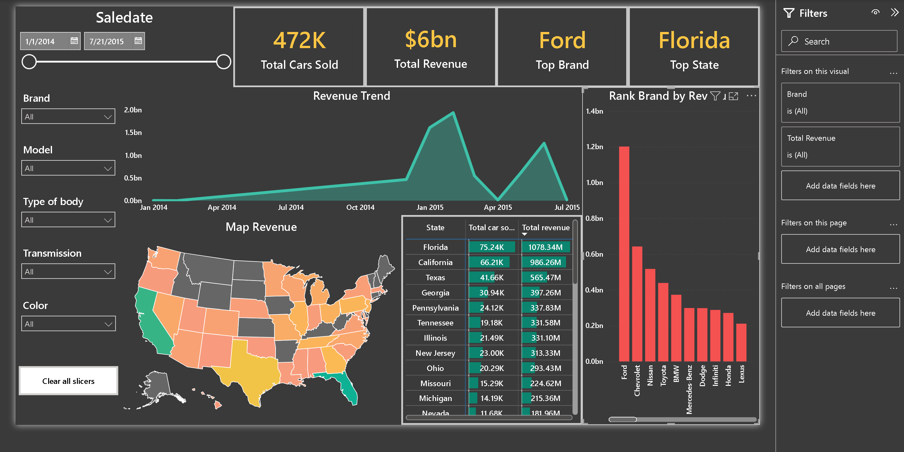
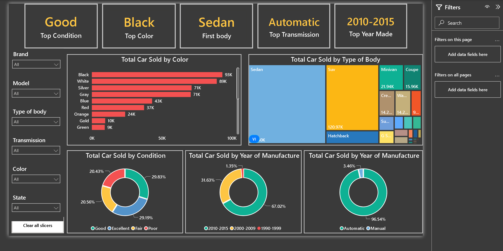

# Vehicle Sales Analytics Dashboard

An end-to-end BI project that analyzes vehicle sales performance across brands, regions, customer segments, and market trends. Raw sales data was imported from CSV, cleaned and preprocessed using Python, and transformed into interactive Power BI dashboards. The project delivers actionable business insights that help managers monitor KPIs, identify high performing markets, and support data-driven decision-making.


## Business Problem

Vehicle sales data was scattered across multiple sources, making it difficult for managers to monitor business performance, identify high-performing markets, and understand customer purchasing behavior. A centralized dashboard was needed to provide timely insights for strategic planning and operational decision-making.


## My Role: Business Analyst & Data Analyst

**Responsibilities**
- Performed data cleaning and transformation using Python.
- Defined business objectives and KPIs.
- Designed an interactive Power BI dashboard.
- Analyzed sales performance and customer behavior.
- Generated business insights and proposed actionable recommendations.


## dashboard_powerBI

### Overview Dashboard



### Sales Analysis Dashboard 



---

## Key Business Insights

- **Ford** generated the highest overall revenue among all vehicle brands.
- **Florida** recorded the strongest sales performance across all states.
- **Automatic transmission** accounted for the majority of vehicle sales.
- **Sedan** remained the most popular vehicle body type.
- Sales revenue reached its peak during *the first quarter of 2015*.

---

## Business Recommendations

- Prioritize inventory for high-performing vehicle models.
- Increase marketing investment in high-potential regions such as Florida.
- Expand product offerings with automatic transmission.
- Optimize sales strategies based on customer purchasing trends.

---

## Technologies

- Python (Data Cleaning & Preprocessing)
- Microsoft Power BI (Data Visualization & Dashboard)

---

## Repository Structure

```text
Vehicle-Sales-Analytics
│
├── readme/
├── assets/
├── dataset/
├── powerbi/
├── report/
```

---

## Project Resources

| Resource | Description |
|----------|-------------|
| Dataset | Vehicle sales dataset |
| Power BI Dashboard | Interactive `Vehicle_Sales_Analytics.pbix` dashboard |
| Business Report | Project documentation (docx) |

---

## Author

**Nguyen Buu Thien Binh**

Management Information Systems Student  
Aspiring Business Analyst

Email: thienbinh.work@gmail.com

LinkedIn: *www.linkedin.com/in/nguyen-buu-thien-binh*
